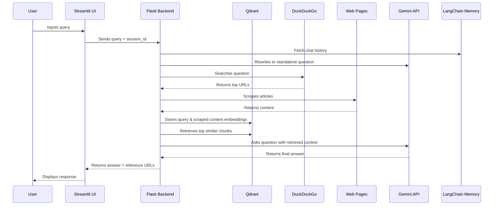
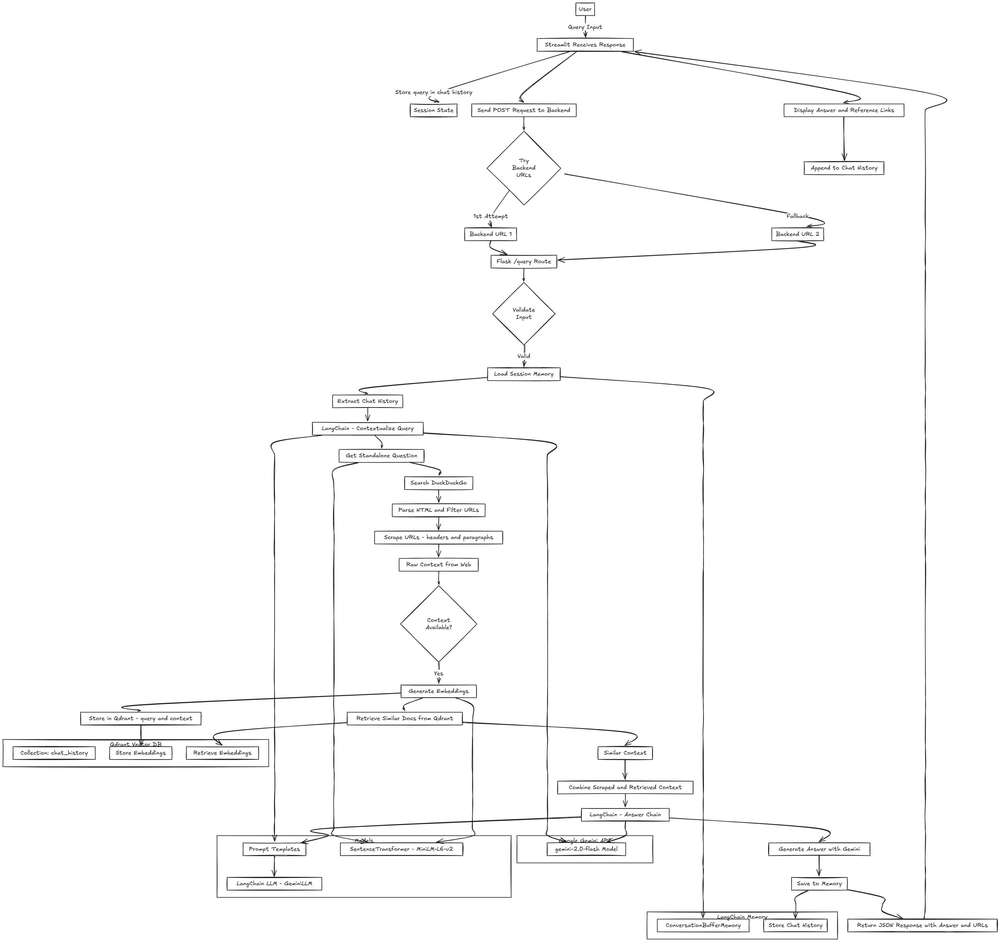
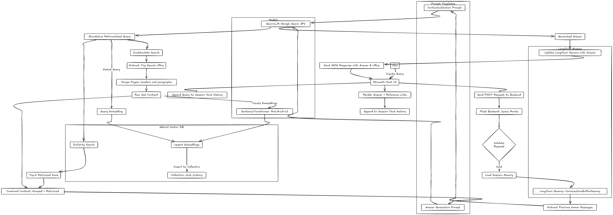
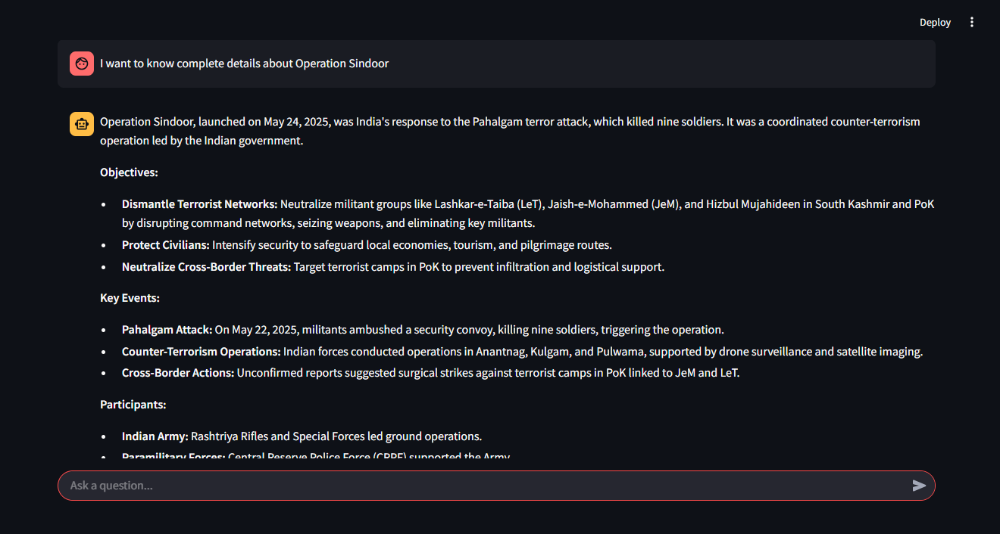
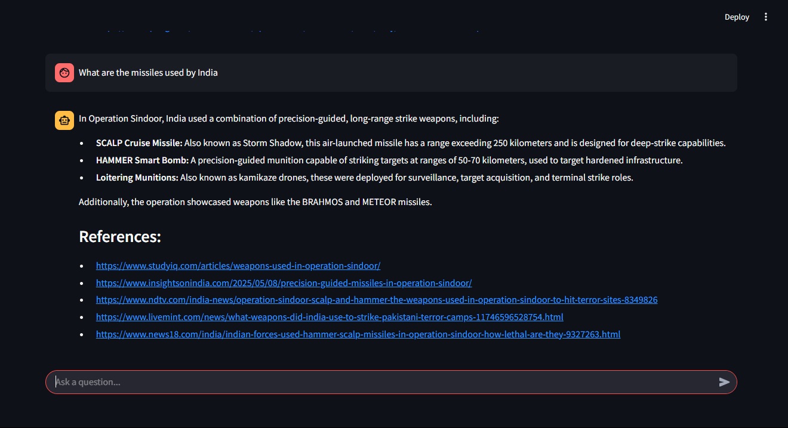

# LLM-based RAG Chatbot

A lightweight **Retrieval-Augmented Generation (RAG)** chatbot powered by Google's Gemini 2.0 Flash model, DuckDuckGo search, and web scraping and Qdrant Vector Database for retrieval. Combines a Flask backend for embedding-based contextual response generation with a Streamlit-based chat UI.

---

## Project Structure

```
RAG-Chatbot
|
├── Backend/                    # Backend service for LLM RAG operations
│   ├── app.py                    # Flask API entry point for /query route
│   ├── chat_service.py           # Orchestrates LLM chain, search, memory, and context generation
│   ├── llm_wrapper.py            # LangChain-compatible wrapper for Google Gemini API
│   ├── qdrant_manager.py         # Manages Qdrant vector DB: connection, collection, upsert, search
│   ├── search_scraper.py         # DuckDuckGo search + web scraping utility
|   ├── logging_config.py         # Files to set the config for logging
|   ├── Backend_logging.log       # File used for logging
│   ├── requirements.txt          # Python dependencies for backend
│   └── Dockerfile                # Dockerfile to containerize backend Flask app
│
├── Frontend/                   # Streamlit-based chat interface for users
│   ├── app.py                    # Streamlit UI entry point with ChatApp class
│   ├── backend_client.py         # Sends user queries to Flask backend and fetches responses
│   ├── session_manager.py        # Manages session ID and chat history using Streamlit's state
│   ├── ui_renderer.py            # Handles display of chat messages and reference links
|   ├── logging_config.py         # Files to set the config for logging
|   ├── Fackend_logging.log       # File used for logging
│   ├── requirements.txt          # Python dependencies for frontend
│   └── Dockerfile                # Dockerfile to containerize Streamlit frontend
│
├── docker-compose.yml          # Multi-container orchestration for backend, frontend, and Qdrant
├── .env                        # Environment file storing API keys (e.g., GEMINI_API_KEY)
└── README.md                   # Project documentation, usage instructions, and setup guide

```

---

## Core Features

- **Session-Based Conversational Memory** via LangChain ConversationBufferMemory
- **Real-Time Search Integration** with DuckDuckGo (via HTML scraping)
- **Web Scraping** of top-ranking result pages using BeautifulSoup
- **Standalone Question Rewriting** using prompt engineering + Gemini
- **LLM-Powered Answer Generation** using Google Gemini 2.0 Flash
- **Semantic Retrieval** using **Qdrant Vector DB + SentenceTransformer**
- **Streamlit Chat UI** for interactive querying
- **LangChain LLMChain** orchestration for prompt templating

---

## Setup Instructions

### Prerequisites

- Python 3.9+
- Google Gemini API access
- Streamlit
- Flask

### Installation

```bash
# Clone the repo
git clone https://github.com/Shesh009/RAG-ChatBot
cd RAG-Chatbot

# Set up virtual environment
python -m venv venv
source venv/bin/activate   # On Windows: venv\Scripts\activate

# Install dependencies

# For Frontend
cd Frontend
pip install -r requirements.txt

# For Backend
cd Backend
pip install -r requirements.txt
```

### Environment Variables

Create a .env file in the root directory and add the required details shown below :

```env
GEMINI_API_KEY = your_google_api_key
LANGCHAIN_API_KEY = your_langsmith_api_key
LANGCHAIN_PROJECT = your_project_name
```

---

## Running the Application 

### Option 1: Run Manually

#### 1. Start the Flask Backend

```bash
cd Backend
python app.py
```

Backend will be available at: http://localhost:5001

- Make sure Qdrant is running locally on port 6333. If not, you can start it via Docker:


```bash
docker run -p 6333:6333 -v $(pwd)/qdrant_data:/qdrant/storage qdrant/qdrant
```

#### 2. Start the Streamlit Frontend

```bash
cd Frontend
streamlit run app.py
```

Frontend will be available at: http://localhost:8501

---

### Option 2: Run with Docker Compose

1. Build the Docker Images

```bash
docker-compose build
```

2. Start the Containers

```bash
docker-compose up
```

Once running:

- Frontend: http://localhost:8501

- Backend: http://localhost:5001

Docker will automatically set up and link both services for you.

- Qdrant: runs as a side container on port 6333 (optional setup if needed)

## Workflow & Architecture



-


---

## Example Query Flow

1. User: “What’s happening with GPT-5?”
2. System:
   - Rewrites to: “What are the latest updates on GPT-5?”
   - Searches DuckDuckGo
   - Scrapes top articles (excluding social media, etc.)
   - Stores embeddings of question + content in Qdrant
   - Retrieves semantically similar content
   - Feeds it to Gemini with the query
   - Generates a helpful answer with source references

---

## Dependencies

Key libraries used:
- `Flask`, `Streamlit` – Backend & frontend
- `google.generativeai` – Gemini API integration
- `requests, bs4` – DuckDuckGo search and scraping
- `qdrant-client` – Vector DB (Qdrant)
- `sentence-transformers` – Embedding generation
- `langchain` – Prompt chaining, memory, orchestration
- `dotenv`, `uuid` – Utility modules

Install all via:

```bash
pip install -r requirements.txt
```

---

## Sample Images


-


---

## Contributing

1. Fork the repo
2. Create a feature branch (`git checkout -b feature-name`)
3. Commit changes (`git commit -am 'Add feature'`)
4. Push to the branch (`git push origin feature-name`)
5. Create a PR

---

## Contact

Questions or feedback? Open an issue or email [sheshusheshu035@gmail.com].
