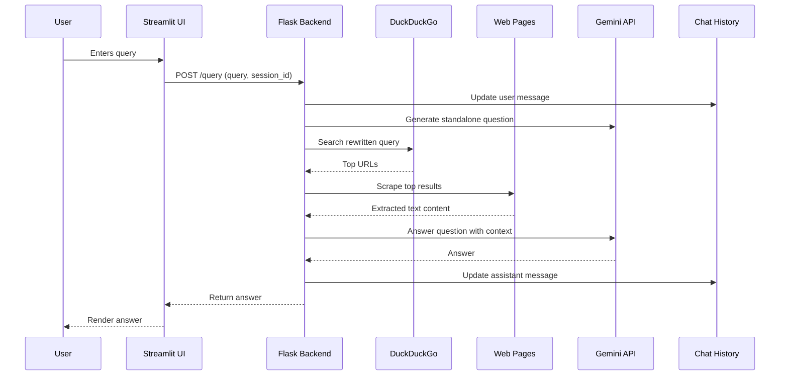
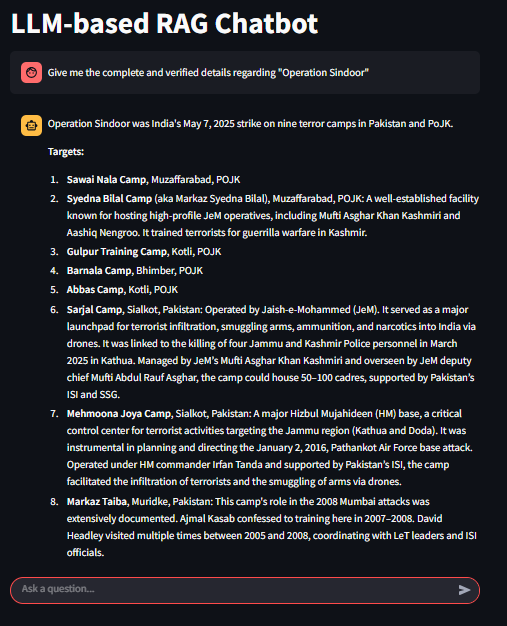
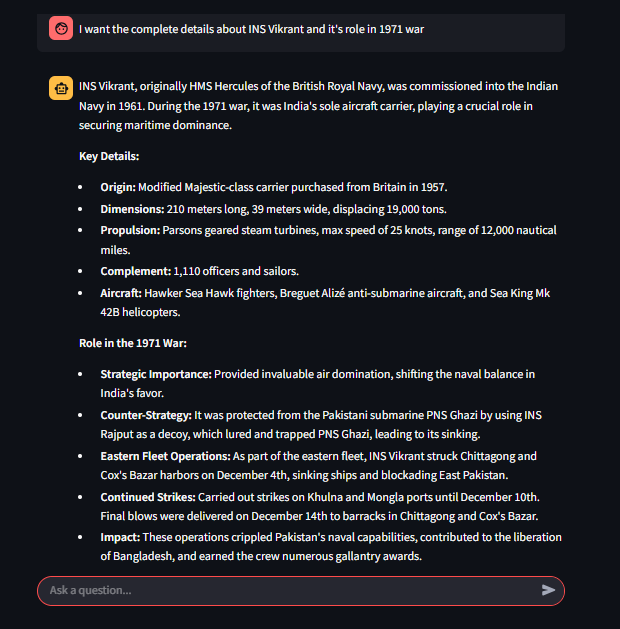

#  LLM-based RAG Chatbot

A lightweight **Retrieval-Augmented Generation (RAG)** chatbot powered by Google's Gemini 2.0 Flash model, DuckDuckGo search, and web scraping. The system includes a Flask backend for contextual search-based response generation and a Streamlit frontend chat UI.

---

## Project Structure

```
.
├── flask_app/               # Flask RAG
│   ├── app.py               # backend
|   ├── Dockerfile           # Dockerfile for backend
│   
├── streamlit_app/
│   └── app.py               # Streamlit chat interface
|   ├── Dockerfile           # Dockerfile for frontend
├── requirements.txt
├── docker-compose           # Docker compose file
└── README.md
└── .env                 # Environment variables  (Gemini API key)
```

---

##  Core Features

-  **Conversational Memory** using session-based in-memory history
-  **Real-time Web Search** via DuckDuckGo HTML scraping
-  **Web Scraping & Content Summarization** from top search links
-  **LLM Integration** using Google Gemini 2.0 Flash
-  **Streamlit UI** for chat-style interaction
-  Basic **prompt contextualization** and standalone question formulation

---

##  Setup Instructions

###  Prerequisites

- Python 3.9+
- Google Gemini API access
- Streamlit
- Flask

###  Installation

```bash
# Clone the repo
git clone https://github.com/Shesh009/RAG-ChatBot
cd RAG-Chatbot

# Set up virtual environment
python -m venv venv
source venv/bin/activate   # On Windows: venv\Scripts\activate

# Install dependencies
pip install -r requirements.txt
```

###  Environment Variables

Put your Google API key in the .env file :

```env
GEMINI_API_KEY=your_google_gemini_api_key
```

---

## Running the Application
### Option 1: Run Manually
#### 1. Start the Flask Backend
```bash
cd flask_app
python app.py
```
Backend will be available at: http://localhost:5001

#### 2. Start the Streamlit Frontend
```bash
cd streamlit_app
streamlit run app.py
```
Frontend will be available at: http://localhost:8501

---

### Option 2: Run with Docker Compose
1. Build the Docker Images
```bash
docker-compose build
```

2. Start the Containers
```bash
docker-compose up
```
Once running:

Frontend: http://localhost:8501

Backend: http://localhost:5001

Docker will automatically set up and link both services for you.

##  Workflow & Architecture


```mermaid
sequenceDiagram
    participant User
    participant Streamlit UI
    participant Flask Backend
    participant DuckDuckGo
    participant Web Pages
    participant Gemini API

    User->>Streamlit UI: Enters query
    Streamlit UI->>Flask Backend: POST /query (query, session_id)
    Flask Backend->>Chat History: Update user message
    Flask Backend->>Gemini API: Generate standalone question
    Flask Backend->>DuckDuckGo: Search rewritten query
    DuckDuckGo-->>Flask Backend: Top URLs
    Flask Backend->>Web Pages: Scrape top results
    Web Pages-->>Flask Backend: Extracted text content
    Flask Backend->>Gemini API: Answer question with context
    Gemini API-->>Flask Backend: Answer
    Flask Backend->>Chat History: Update assistant message
    Flask Backend-->>Streamlit UI: Return answer
    Streamlit UI-->>User: Render answer
```

---

##  Example Query Flow

1. User: "What's the latest on OpenAI's GPT-5?"
2. Backend:
   - Contextualizes to: "What is the latest update on OpenAI's GPT-5 model?"
   - Searches DuckDuckGo for relevant pages
   - Scrapes top articles
   - Asks Gemini for a creative answer using that content
3. Streamlit renders the final assistant answer

---

##  Dependencies

- `Flask` – lightweight backend framework
- `Streamlit` – chat frontend
- `google.generativeai` – Gemini model API
- `requests`, `bs4` – DuckDuckGo search and scraping
- `dotenv`, `uuid`, `collections` – misc utilities

Install all via:

```bash
pip install -r requirements.txt
```

---

## Sample Images


---


---

##  Contributing

1. Fork the repo
2. Create a feature branch (`git checkout -b feature-name`)
3. Commit changes (`git commit -am 'Add feature'`)
4. Push to the branch (`git push origin feature-name`)
5. Create a PR

---


##  Contact

Questions or feedback? Open an issue or email [sheshusheshu035@gmail.com].
